## 计算机毕业设计吊打导师hadoop+spark+hive动漫分析可视化大屏 动漫推荐系统 漫画推荐系统 漫画爬虫 漫画推荐系统动漫爬虫 知识图谱 大数据毕业设计 知识图谱 机器学习 大数据毕设 房价预测系统 数据仓库 大数据毕业设计 文本分类 LSTM情感分析 大数据毕业设计 知识图谱 大数据毕业设计 预测系统 实时计算 离线计算 数据仓库 人工智能 神经网络

## 要求
### 源码有偿！一套(论文 PPT 源码+sql脚本+教程)

### 
### 加好友前帮忙start一下，并备注github有偿hive动漫漫画
### 我的QQ号是2827724252或者798059319或者 1679232425或者微信:bysj2023nb

# 

### 加qq好友说明（被部分 网友整得心力交瘁）：
    1.加好友务必按照格式备注
    2.避免浪费各自的时间！
    3.当“客服”不容易，repo 主是体面人，不爆粗，性格好，文明人。

基础版，也就是当前下面连接这个版本(只带hadoop spark hive flask selenium echarts大屏可视化驾驶舱)

https://www.bilibili.com/video/BV1ph4y1m73W/?spm_id_from=333.999.0.0

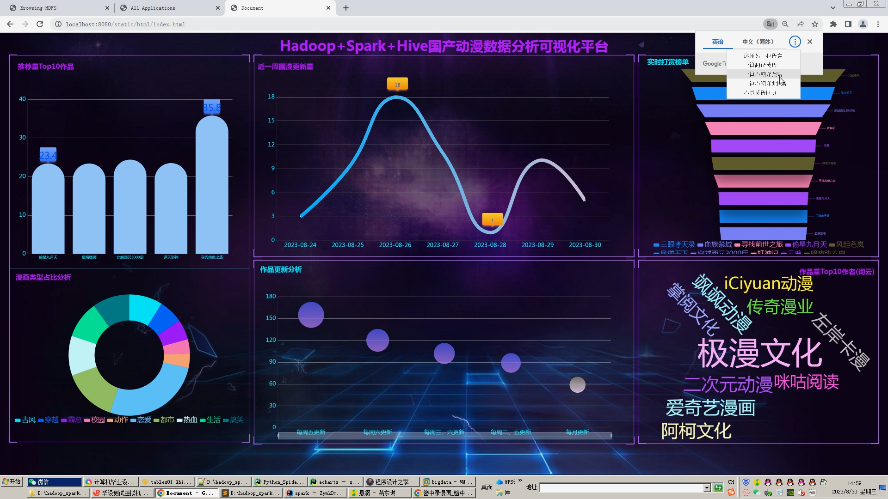
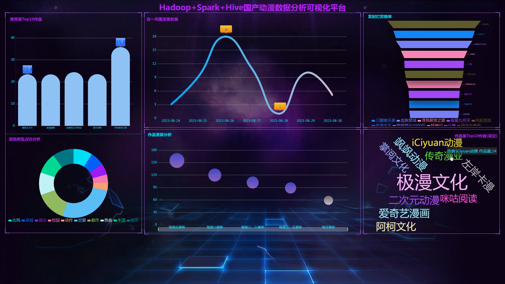
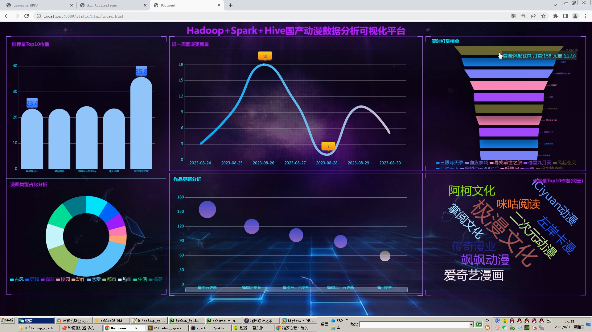
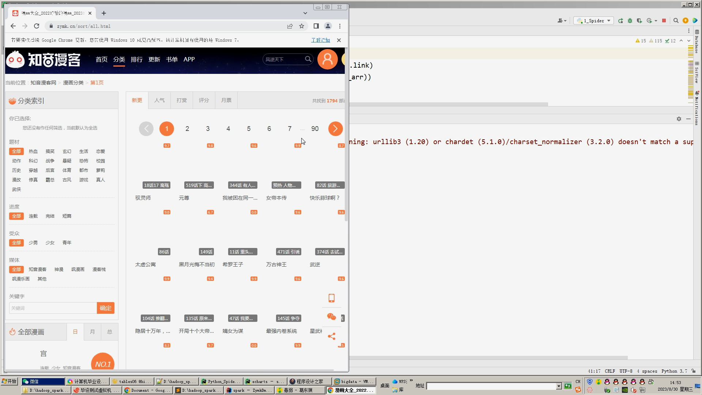
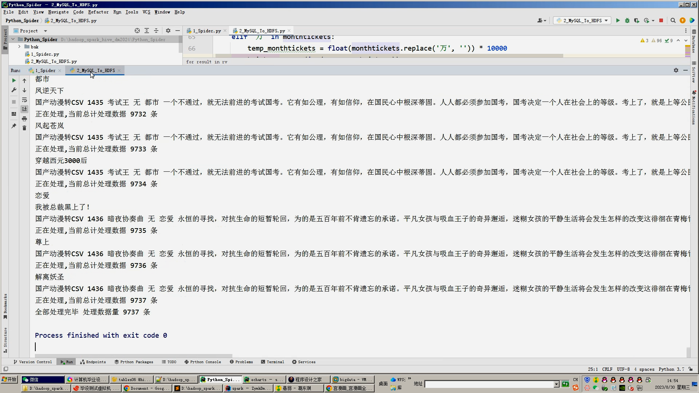
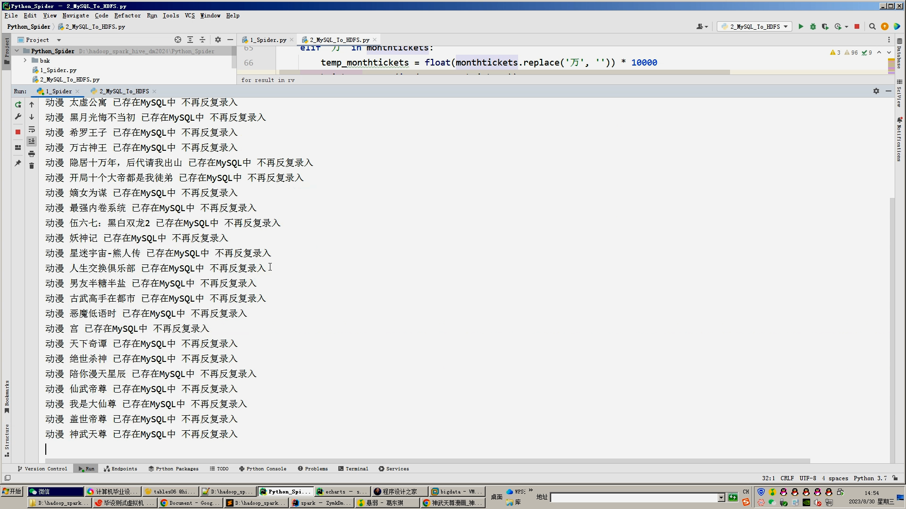
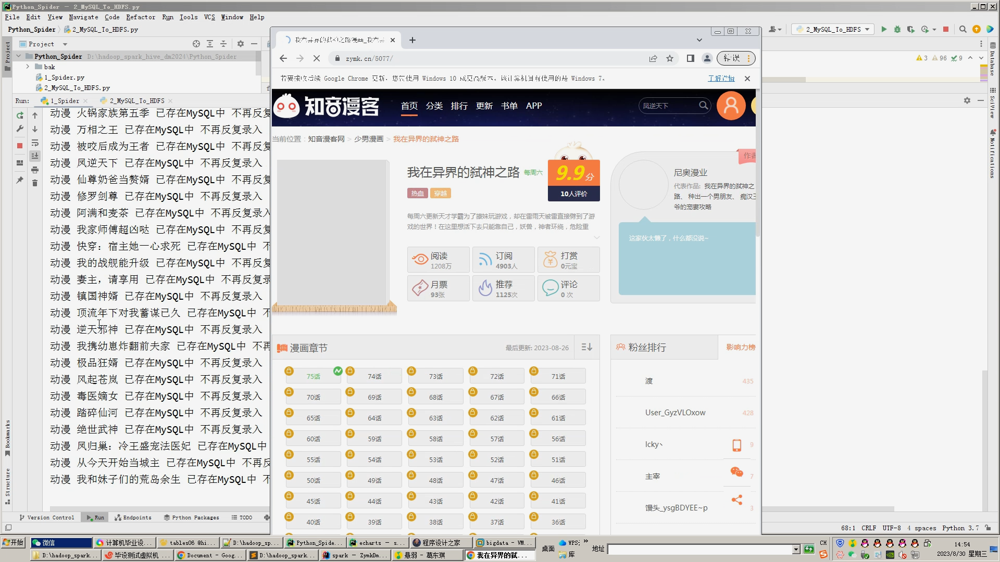
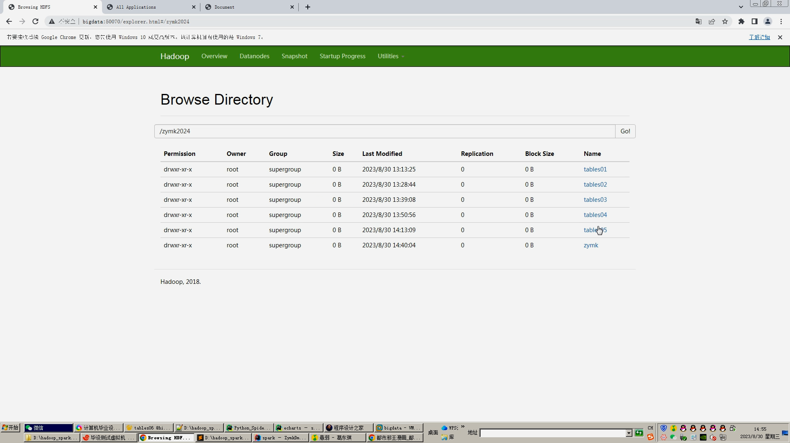
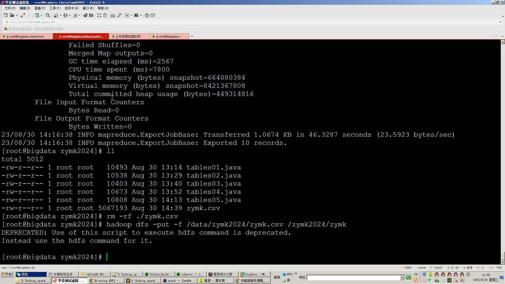
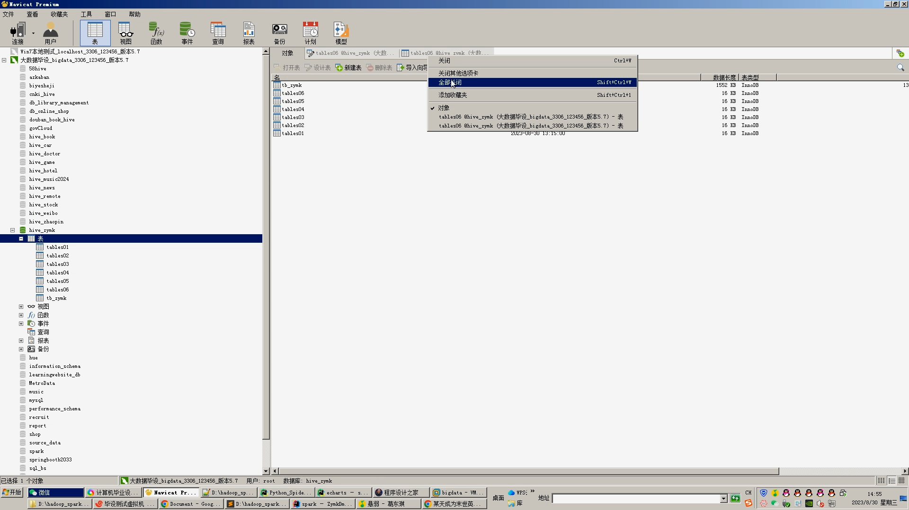
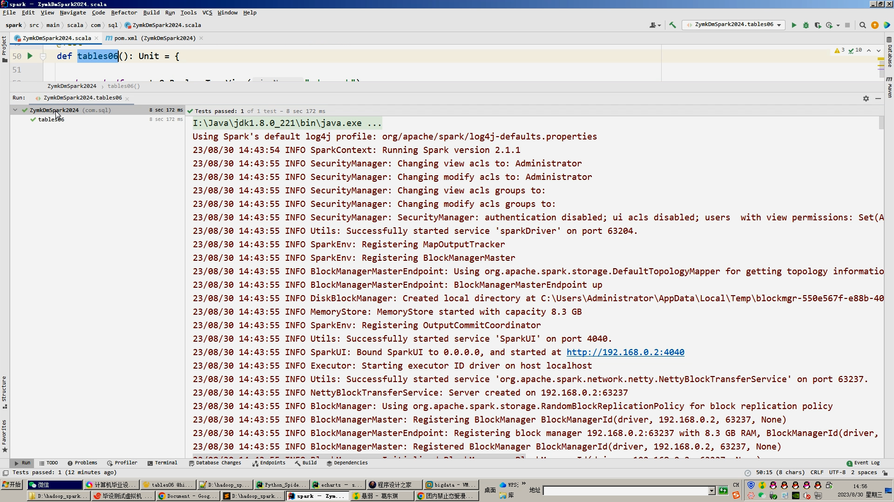
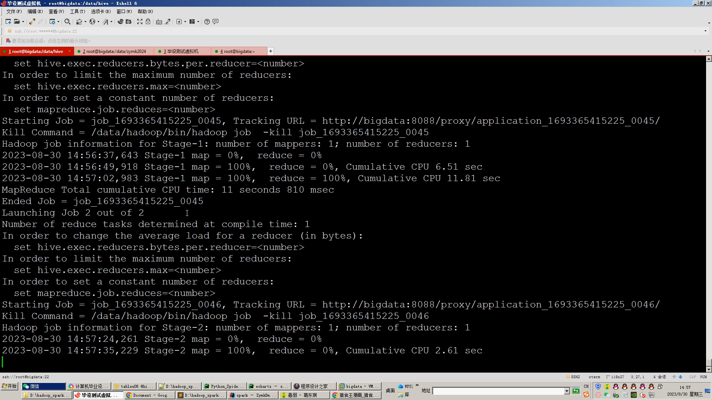
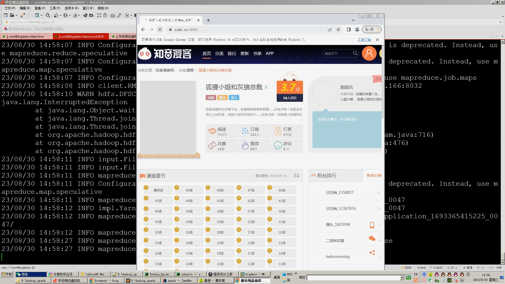

## 开发技术：
spark hadoop hive 装杯显摆虚拟机Linux敲命令炫酷吊打 flask echarts sqoop scala hdfs yarn mysql DrissionPage爬虫框架等；

## 流程： 

1.DrissionPage采集知音漫客约2万条国产动漫数据存入mysql数据库；
2.Mapreduce对采集的动漫数据进行数据清洗、拆分数据项等，转为.csv文件上传hadoop的hdfs集群；
3.hive建库建表导入.csv动漫数据；
4.一半指标使用hive_sql分析得出，一半指标使用Spark之Scala完成；
5.sqoop对分析结果导入mysql数据库；
6.Flask+echarts搭建可视化大屏；

## 创新点：
Python全新DrissionPage爬虫使用、海量数据、爬虫、可视化大屏、离线hive+实时Spark双实现、使用vmvare虚拟机模拟大数据环境等

如果他(导师)还是狂喷不止，继续选择以下的系统，他们可以选装牛鼻功能！

## 可选装项目模块如下：
1.推荐系统(4种深度学习推荐算法 协同过滤基于用户 基于物品 SVD神经网络 MLP)。附带AI、支付、短信、lstm情感分析。
2.预测系统(KNN CNN RNN卷积神经预测 K-means 线性回归)。
3.知识图谱neo4j可视化关系网络图。
4.后台管理系统。

## 注意：以上1234部分均采用springboot+vue.js前后端分离架构！！！

